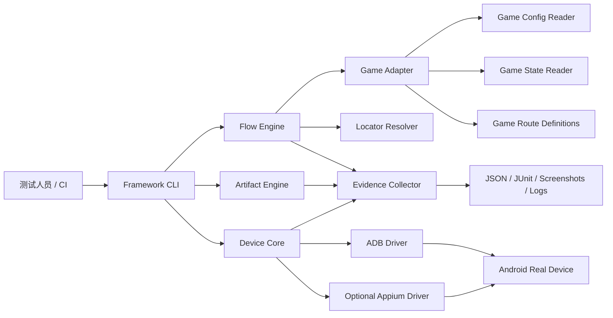

# Game Auto Test Framework

面向 Android 真机游戏的通用自动化测试框架。

框架把设备控制、包体生命周期、流程执行、定位后端、证据采集和报告输出放在通用核心；每个游戏只提供独立的 Adapter、配置解析器和真实游玩流程。

## 设计目标

- 支持 APK、AAB 和 APKS 的验证与真机安装。
- 以 ADB 作为所有 Android 设备的基础控制通道。
- 以 Appium UiAutomator2 作为可选的原生 Android UI 后端。
- 支持 Unity、原生 Android、WebView 和其他游戏技术栈的适配包。
- 让真实用户操作流程可以使用配置、状态和语义定位驱动，而不是依赖固定坐标。
- 为每一步保留截图、logcat、设备信息、性能信息和失败原因。
- 通用核心与具体游戏解耦，游戏适配包可以独立版本化。

## Architecture



## Repository Layout

```text
packages/core/                 Generic flow and lifecycle contracts
packages/adb-driver/           ADB process and device implementation
packages/appium-driver/        Optional UiAutomator2 implementation
packages/artifact-engine/      APK/AAB/APKS verification
packages/report-engine/        JSON/JUnit/evidence reports
adapters/idle-outpost/         First game adapter
adapters/<game-name>/          Future game adapters
schemas/                       Versioned route and adapter schemas
docs/design/                   Design and architecture explanation
docs/diagrams/                 Mermaid source diagrams
```

## First Adapter

Idle_Outpost is the first adapter and is not part of the generic core. Its
responsibilities include TestServer selection, Excel/runtime configuration
mapping, Unity Canvas locator support, account/archive preparation, and the
first real player route.

## Planned Commands

```text
game-auto-test doctor
game-auto-test artifact verify --adapter idle-outpost
game-auto-test device inspect --serial <serial> --adb-port <port>
game-auto-test run --adapter idle-outpost --route <route-file> --artifact <apk-or-apks> --serial <serial> --adb-port <port>
```

The current TypeScript entry point is `cli/src/main.ts`. On Windows, the
PowerShell wrapper forwards all arguments and preserves the CLI exit code:

```powershell
.\Tools\Invoke-GameAutoTest.ps1 run --adapter fake-game --route .\route.yaml --artifact .\game.apk --serial <serial>
```

Reports are written below `<output-dir>/<run-id>/<serial>/`. A route run emits
`run.json`, `junit.xml`, and an `evidence/` directory. The stable exit codes
are `0` for PASS, `1` for a controlled test failure, `2` for a blocked
prerequisite, `3` for invalid arguments or configuration, and `10` for an
unexpected host-tool failure. JSON report fields whose names contain tokens,
secrets, passwords, credentials, or signing keys are redacted.

Continuation routes may set `accountPolicy: preserve` in the route YAML when
they must continue from a previously verified gameplay checkpoint. The
default is `reset-existing`, which keeps zero-state routes on the explicit
new/existing account safety path.

Idle_Outpost terrain continuation routes follow the game's visible cost order,
not raw upgrade ID order. The third visible item in the current terrain is
`UpgradeId=4` at 57 coins; `UpgradeId=3` at 320 coins remains the next item and
is not clicked implicitly.

For real-device routes, the game adapter must provide an account detector. It
opens the app first, skips the reset chain for a new account, and runs the
configured settings/account/delete/confirm/restart chain for an existing
account. The adapter must verify that the post-restart state is new before the
player route starts. See [Account State Reset](docs/architecture/account-state-reset.md).

## Documentation

- [Architecture Design](docs/design/architecture.md)
- [Flow DSL Design](docs/design/flow-dsl.md)
- [Architecture Diagram](docs/diagrams/architecture.mmd)
- [Architecture Documentation Index](docs/architecture/README.md)
- [Overall Architecture](docs/architecture/overall.md)
- [Project Structure](docs/architecture/project-structure.md)
- [Configuration Parsing Strategy](docs/architecture/config-parsing-strategy.md)
- [Game Adapter Contract](docs/architecture/game-adapter.md)
- [Idle_Outpost First Route](docs/architecture/idle-outpost-first-route.md)
- [Account State Reset](docs/architecture/account-state-reset.md)
- [Real Device Run](docs/architecture/real-device-run.md)
- [Screen Recognition](docs/architecture/screen-recognition.md)

The interactive architecture browser is a later documentation-surface task;
it must remain separate from the execution core.
