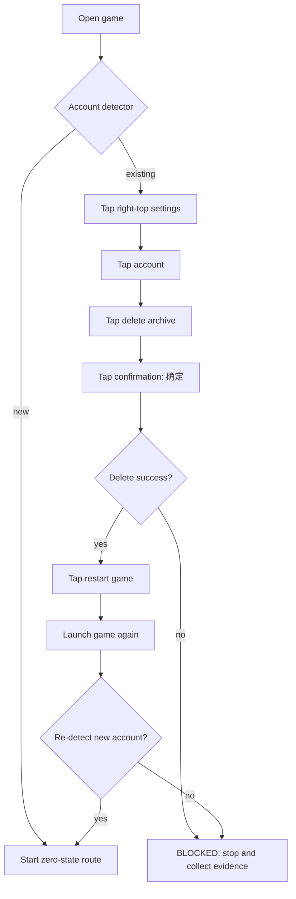

# Account State Reset

The first real-device route must start from zero. The adapter therefore treats
account state as a guarded precondition, not as an assumption in the route
file.

## Safety rules

- `new` means the detector has positively recognized the first-time state; an
  indeterminate state is a failure, not an implicit new account.
- `existing` uses the in-game deletion chain so the same server/account
  semantics are exercised as a real player action.
- `pm clear` is not the replacement for this flow. It clears local Android
  storage but does not prove that the game's account deletion behavior works.
- The route is allowed to start only after the post-restart detector returns
  `new`.
- Destructive actions are adapter-owned and remain outside the generic core.

## Current implementation boundary

`IdleOutpostAdapter.prepareContext` performs the guarded branch. The default
Idle_Outpost screenshot factory uses the PNG template reader to produce a
normalized `StateSnapshot`, and `IdleOutpostUiAccountResetter` resolves the
adapter's logical targets before sending ADB taps. The reader fails closed on
an unknown screen. A game may replace the PNG matcher with OCR, OpenCV, a QA
bridge, or Appium for native dialogs; Unity Canvas content is not exposed as
native Android nodes by ADB alone.
