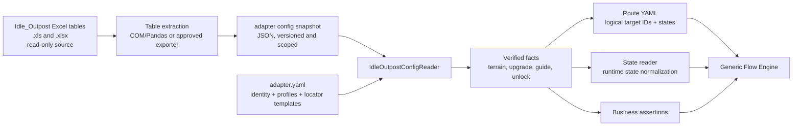

# Configuration Parsing Strategy

Configuration is read outside the generic core. For Idle_Outpost, the source
tables are maintained in the game project and a small, versioned snapshot is
checked into the adapter so host-side tests remain reproducible without
copying the full game project or Excel files into the framework repository.

## Current verified facts

The snapshot used by the first adapter proof records:

- system unlock item `ID=2`, named `沙盘升级项`;
- first terrain `TerrainId=1`, scene `Level_1_0`;
- first terrain upgrade `UpgradeId=1`, type `3`, cost `13` coins;
- guide targets `TerrainUpgeade1` and `TerrainUpgeade3`;
- the corresponding Unity object paths are kept in the adapter snapshot, not
  in the generic flow engine.

## Boundary rules

1. The generic core consumes normalized contracts, never Excel cells.
2. The adapter snapshot is a minimal evidence-backed subset, not a replacement
   for the source tables.
3. Every snapshot records source filenames and capture date.
4. A changed source table requires a new snapshot review before changing a
   route or its assertions.
