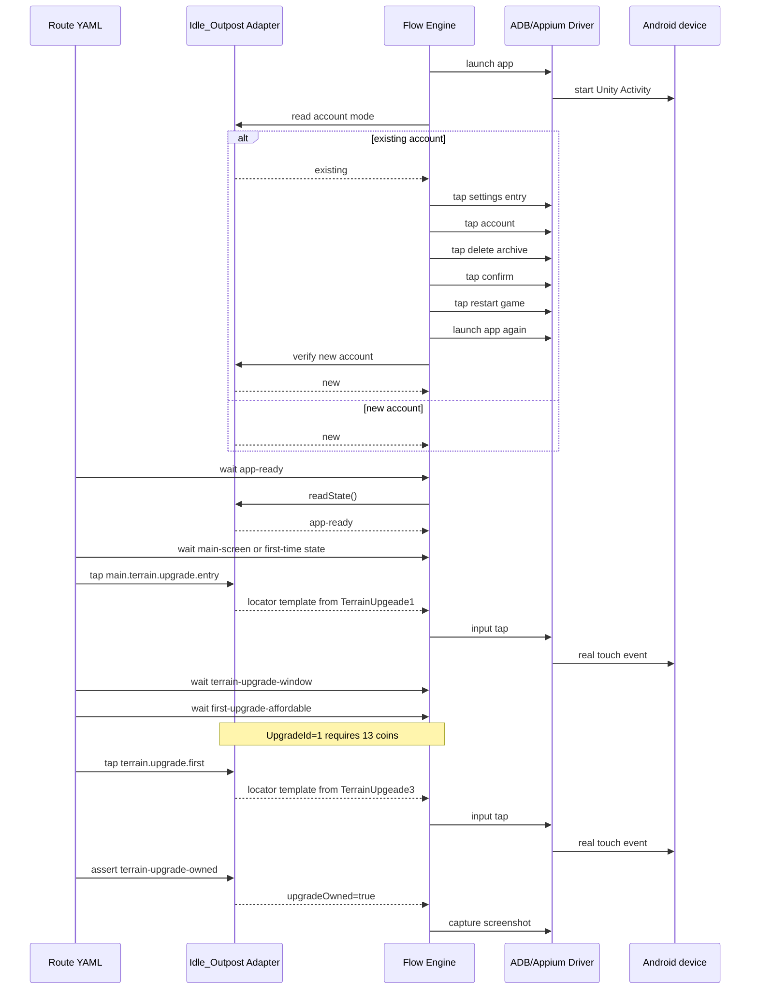

# Idle_Outpost First Route

This route is intentionally a real player-flow simulation rather than a
coordinate macro. Before the player steps start, the adapter opens the app
and normalizes account state. A new account skips deletion and continues from
the first-time flow; an existing account follows the explicit settings/account
deletion chain and must be re-detected as new after restart.

The route is stored at
`adapters/idle-outpost/routes/first-upgrade.yaml`. Its facts are sourced from
the versioned snapshot at
`adapters/idle-outpost/config/idle-outpost-config.snapshot.json`.

The image-template locator files are an adapter-owned runtime dependency. The
account reset targets are normalized points calibrated against the observed
`720x1604` device and scale through the generic locator contract. A future
image/Appium state backend can replace the state reader without changing the
route or reset sequence.
