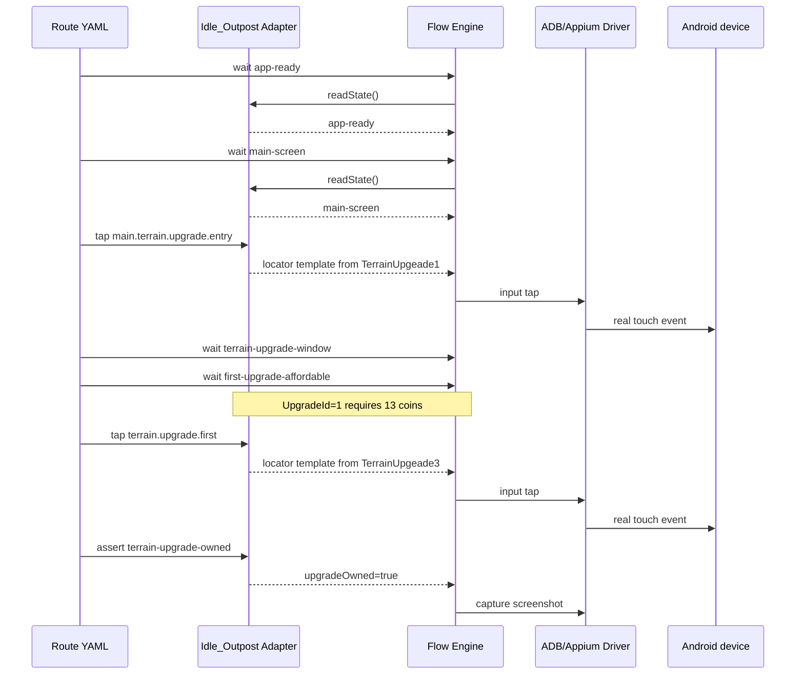

# Idle_Outpost First Route

This route is intentionally a real player-flow simulation rather than a
coordinate macro. It starts from an existing, logged-in account because the
first-run system consent and account setup are explicit preconditions for the
real-device task; they are not silently auto-accepted by the route.

The route is stored at
`adapters/idle-outpost/routes/first-upgrade.yaml`. Its facts are sourced from
the versioned snapshot at
`adapters/idle-outpost/config/idle-outpost-config.snapshot.json`.

The image-template locator files are an adapter-owned runtime dependency. The
first host-side proof validates their logical mapping; the real-device proof
will provide and calibrate the templates or a runtime rectangle resolver.
