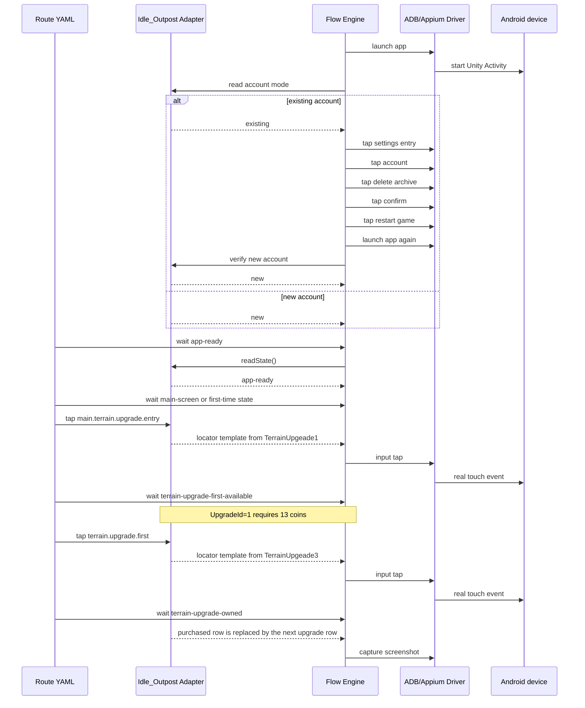

# Idle_Outpost First Route

This route is intentionally a real player-flow simulation rather than a
coordinate macro. Before the player steps start, the adapter opens the app
and normalizes account state. A new account skips deletion and continues from
the first-time flow; an existing account follows the explicit settings/account
deletion chain and must be re-detected as new after restart.

The route is stored at
`adapters/idle-outpost/routes/buy-first-terrain-upgrade.yaml`. Its facts are sourced from
the versioned snapshot at
`adapters/idle-outpost/config/idle-outpost-config.snapshot.json`.

The image-template locator files are an adapter-owned runtime dependency. The
account reset targets are normalized points calibrated against the observed
`720x1604` device and scale through the generic locator contract. A future
image/Appium state backend can replace the state reader without changing the
route or reset sequence.

The Motorola calibration also recognizes the observed `next-scene-unlock`
tutorial checkpoint as `accountMode: new`. The
`dismiss-next-scene.yaml` route uses the calibrated
`tutorial.chapter1.entry` and `tutorial.next-scene.close` targets to exercise
the observed `new-account -> next-scene-unlock -> new-account` loop. The
framework deliberately does not purchase or unlock the next scene implicitly.

The Motorola calibration also recognizes `equipment-upgrade-window` and exposes
`tutorial.equipment.upgrade` as a logical action. The live session currently
shows the sword workshop at level 15 with a 77-coin cost after earlier manual
progress, so this milestone stops before purchase. The first-upgrade purchase
must be verified only after a fresh zero-state account is prepared.

For the actual zero-state path, `open-equipment-build.yaml` advances the
intro-story checkpoint, enters the first sword workshop slot, and stops at
`equipment-build-window`. The configured `tutorial.equipment.build` action is
then used by `build-first-equipment.yaml`; that route consumes the 5-coin build
cost once and asserts `equipment-build-complete`.

The route `open-terrain-upgrade.yaml` opens the main terrain upgrade window
through the configured bottom-right entry and verifies the first available
item. The follow-up route `buy-first-terrain-upgrade.yaml` requires the
`terrain-upgrade-first-available` state before tapping the configured first
upgrade, then waits for `terrain-upgrade-owned`. The purchased screenshot
template is intentionally scoped to the first row name and is threshold-tested
against the pre-purchase screenshot so the route cannot silently skip or
repeat the purchase.

The continuation route
`adapters/idle-outpost/routes/buy-second-terrain-upgrade.yaml` sets
`accountPolicy: preserve`, because it continues from the verified first
upgrade instead of deleting the account and starting over. Configuration
snapshot `UpgradeId=2` costs 30 coins. It accepts an already completed second
upgrade as a terminal state and sends no tap in that case.

The next continuation route is
`adapters/idle-outpost/routes/buy-third-visible-terrain-upgrade.yaml`.
The source sheet contains `UpgradeId=4` as the 57-coin profit upgrade and the
game UI sorts remaining rows by `NeedCoin`, so this item appears before
`UpgradeId=3` at 320 coins. The route buys only the 57-coin row and treats the
post-purchase 320-coin row as `terrain-upgrade-third-owned`; it never clicks
that later row automatically.
