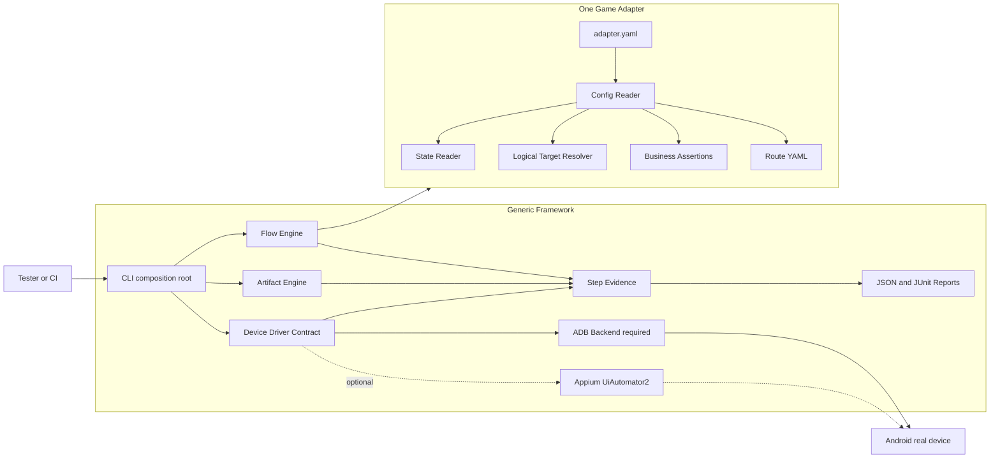

# Overall Architecture

The framework is split into a generic execution layer and game-owned adapter
packages. Android real devices remain the primary runtime target. ADB is the
required device backend; Appium is an optional native-UI supplement.

The generic layer must not import a game namespace, read a game Excel file,
assume Unity, or encode a game-specific screen path. The adapter owns those
facts and exposes only the generic `GameAdapter` contract.

Route-level account policy is generic: `reset-existing` is the default for
zero-state runs, while `preserve` is available for a verified continuation
route. The generic runner forwards the value; each adapter owns the safe
states and whether an existing account may continue.
