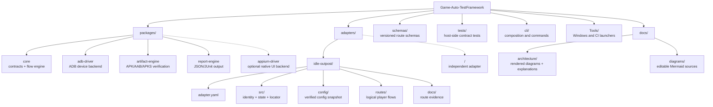

# Project Structure

The repository keeps framework code, game adapters, schemas, evidence, and
documentation in separate ownership areas. Solid nodes are implemented in
the current bootstrap; dashed nodes are planned extension points.

An adapter may add files under its own directory, but it must not modify
`packages/core` to encode game-specific behavior. The CLI may compose adapters
at the application boundary; the execution contracts remain game-neutral.
