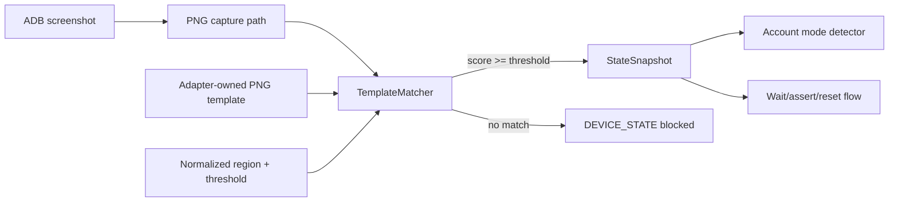

# Screen Recognition

The framework uses a small image-recognition boundary for game surfaces that
do not expose native Android nodes. A matcher compares an adapter-owned PNG
template with a normalized region of an ADB screenshot, resizing the region to
the template dimensions so the same definition can be used across display
sizes.

## Recognition rules

- Templates are small UI anchors, not complete screenshots and not account
  data dumps.
- Each template declares its normalized region and threshold beside the
  adapter configuration.
- The reader reports the winning state and score for evidence.
- No match is an indeterminate state and blocks the route; it never defaults to
  `new`.
- Startup network errors are an explicit adapter state with a bounded retry
  action, so a pale modal cannot be mistaken for a destructive account dialog.
- Cloud-sync splash screens are explicit transient states and are waited out
  before account classification; persistent splash screens fail closed.
- First-time intro story screens are explicit `new` account states; their skip
  action remains a route-owned decision rather than an implicit startup tap.
- Appium can supplement native Android dialogs, but Unity Canvas states still
  require image, OCR, or a game-owned QA bridge.

The current generic implementation is
`packages/screen-recognition/src/png-template-matcher.ts`; game-specific
templates and state names live under the adapter package.
