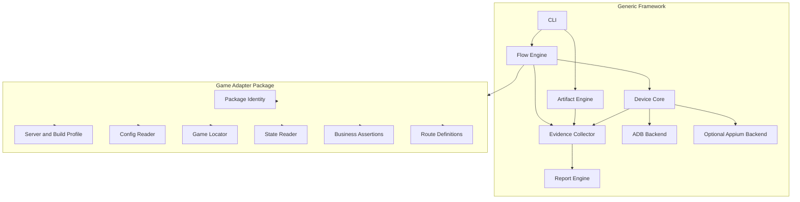
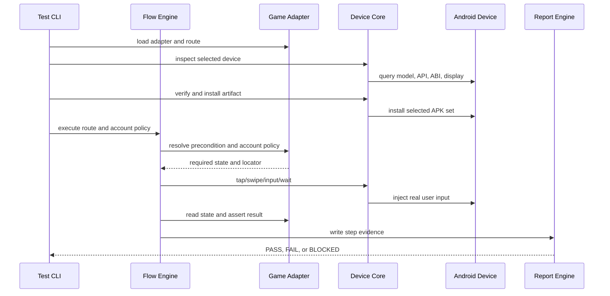
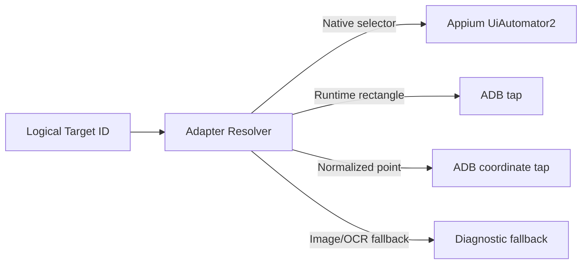

# Generic Android Game Test Framework Architecture

## Goal

Build one reusable Android real-device automation framework. A game-specific
adapter supplies business knowledge; the framework supplies execution,
device control, evidence, and reporting.

## Boundary



The generic layer must not import a game namespace, read a game Excel file,
know a game UI path, or assume that the game is built with Unity.

Route-level account policy is generic: `reset-existing` is the default for
zero-state runs, while `preserve` is available for a verified continuation
route. The generic runner forwards the value; each adapter owns the safe
states and whether an existing account may continue.

## Runtime Sequence



## Core Contracts

### Device Driver

The device driver exposes only platform operations:

```text
listDevices()
inspectDevice(serial)
installArtifact(serial, artifact)
clearData(serial, packageId)
launch(serial, packageId, activity)
tap(serial, x, y)
swipe(serial, start, end, duration)
inputText(serial, text)
captureScreenshot(serial)
captureLogcat(serial)
collectPerformance(serial, packageId)
```

ADB is the required implementation. Appium is an optional implementation of
the same capability boundary and is not required for the first smoke loop.

### Game Adapter

The adapter supplies:

```text
identity()
profiles()
prepareContext(context)
waitReady(context)
resolveTarget(targetId, context)
readState(context)
assertState(assertion, context)
cleanupContext(context)
```

`resolveTarget` may return an Android selector, a Unity runtime rectangle, a
normalized coordinate, or a controlled fallback. The framework does not know
which locator type a game uses.

## Locator Policy



The preferred result is still a real ADB input. A Unity-specific bridge may
report the current screen rectangle without directly invoking the game action;
the framework then taps that rectangle through ADB.

## Artifact Policy

Artifact classification is adapter-owned. File timestamps must never be a
generic TestServer/formal-server rule. The Idle_Outpost adapter may use the
currently agreed timestamp convention, while another game can use manifest
metadata, filename conventions, or an external release manifest.

## Failure Model

Every failure maps to one category:

```text
HOST_TOOL
DEVICE_CONNECTION
DEVICE_STATE
ARTIFACT_METADATA
INSTALLATION
APPLICATION_STARTUP
NATIVE_UI_LOCATOR
GAME_LOCATOR
WAIT_TIMEOUT
NETWORK
CRASH
ANR
BUSINESS_ASSERTION
```

Failure handling must capture evidence before retrying. Retries are limited
and must never hide a deterministic business assertion failure.

## Versioning

- Core packages use semantic versioning.
- Game adapters have independent versions and declare the compatible core
  range.
- Route schemas are versioned and validated before execution.
- Reports include core version, adapter version, route version, artifact hash,
  device serial, and tool versions.
